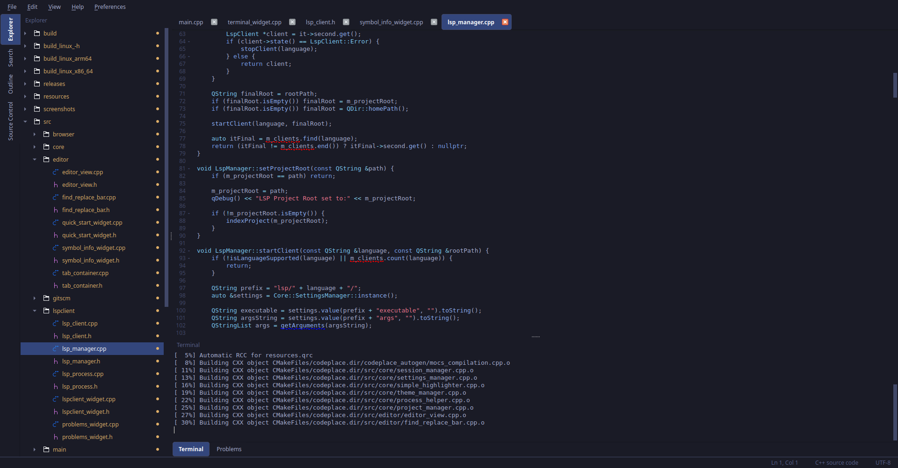
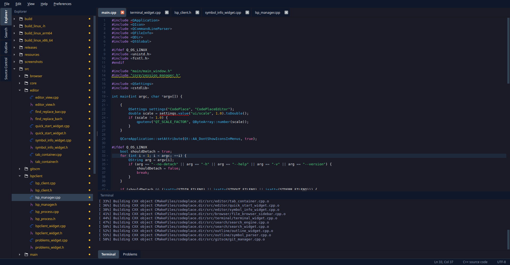

# CodePlace Editor

A lightweight, fast code editor built with C++ and Qt. Whether you're working on a quick script or managing a larger project, CodePlace provides a clean, distraction-free environment with powerful features to boost your productivity.

---

## Screenshots




---

## Features

| Feature | Description |
|---|---|
| **File Browser** | Browse your files and folders. |
| **Session Management** | Automatically save and restore your editing sessions. |
| **Theme Management** | Choose from multiple themes or create your own using QSS (Qt Style Sheets). |
| **Syntax Highlighting** | Support for 23 programming languages and file formats. |
| **Multi-Tab Editing** | Work with multiple files simultaneously using an intuitive tab interface. |
| **Integrated Terminal** | Run commands and scripts directly in the editor. Uses bash. |
| **Git Integration** | Built-in Source Control Management via Git. |
| **LSP Support** | Language Server Protocol support for intelligent code completion, errors, and warnings. Note: you must provide the path to the LSP server for each language. |

For a more detailed breakdown of what CodePlace can do, see [FEATURES.md](FEATURES.md).

---

## Supported Languages

CodePlace supports syntax highlighting and LSP integration across a wide range of languages and formats:

| Category | Languages |
|---|---|
| **Core Programming & Scripting** | C, C++, C#, Dart, Go, Java, Kotlin, Lua, Perl, PHP, Python, Ruby, Rust, Shell, Swift |
| **Web & Frontend** | CSS, HTML, JavaScript, TypeScript |
| **Data, Markup & Query** | JSON, Markdown, SQL, XML, YAML |

---

## Getting Started

### Prerequisites

**Note:** CodePlace is built and tested on Linux/WSL2. We don't support macOS or native Windows right now. It's just easier to focus on doing one platform really well.

Before building, make sure you have:

- **CMake** (3.16+)
- **Qt6** (Core, Gui, Widgets, Network, Concurrent)
- **C++ Compiler** (C++17 support)
- **Build Tools** (Make, etc.)

On Ubuntu/Debian:
```bash
sudo apt-get install cmake qt6-base-dev qt6-tools-dev build-essential
```

## Building from source

If you want to build and install from scratch, we've provided a script that handles the cleanup, build, and installation in one go:

```bash
chmod +x install.sh
./install.sh
```

Alternatively, you can do it manually:
1. Build it:
   ```bash
   mkdir -p build && cd build
   cmake ..
   make -j$(nproc)
   ```
2. Install it:
   ```bash
   sudo make install
   ```

---

## Installation

### Debian/Ubuntu (.deb)
We offer a `.deb` package for Debian/Ubuntu based systems. You can download and install it from our [Releases](https://github.com/co3ndev/codeplace-editor/releases) page:
```bash
sudo apt install ./codeplace-editor-*.deb
```

### Generic Linux (.tar.gz)
For other distributions or if you prefer a standalone archive, download the `.tar.gz` from the Releases page. It includes an `install.sh` script to handle installation:
```bash
tar -xzf codeplace-editor-*.tar.gz
cd codeplace-editor-*
./install.sh
```

---

## Configuration

CodePlace stores its configuration at `~/.config/codeplace/`. You can manually edit these files to customize editor behavior and keybindings, theme colors and fonts, default file associations, and session restoration preferences.

---

## Troubleshooting

**Editor won't start**
- Ensure Qt6 libraries are properly installed.
- Check that your system meets the minimum requirements.
- Try deleting `~/.config/codeplace/` to reset to defaults.

**Syntax highlighting not working**
- Verify the file extension is recognized.
- Check that the language appears in the supported list above.
- Try switching themes to see if it's theme-specific.

**Performance issues**
- Close unused tabs to reduce memory usage.
- Disable syntax highlighting for very large files.
- Check available system memory.
- If the problem persists, open an issue with as much detail as possible.

For more help, view our [Issues](https://github.com/co3ndev/codeplace-editor/issues) page.

---

## Contributing

We welcome contributions from the community: bug reports/fixes, new features, documentation improvements, whatever you're up for. See the [Contribution Guide](CONTRIBUTING_GUIDE.md) to get started.

---

## Branches

To ensure stability, we follow a simple branching model:

- **`main`**: The stable branch. This is where releases are tagged from.
- **`testing`**: Our active development branch. All new code moves here first for validation and community testing before being merged into `main`.

Please base your contributions on the `testing` branch when possible.

---

## Roadmap

A few things we're actively working on:

- **Plugin system** *(high priority)* - extend the editor with custom functionality.
- **Internal AI chat** - a focused tool for documentation and code referencing. Generative AI is not planned to be a core pillar of this editor.

Have a feature request? [Open an issue](https://github.com/co3ndev/codeplace-editor/issues). CodePlace is meant to be a tool for developers, by developers.

---

## License

CodePlace Editor is licensed under the **GNU General Public License v3.0 (GPLv3)**. See [LICENSE](LICENSE) for the full text. In short, you're free to use, modify, and distribute this software, provided you maintain the same license for any derivative works.

---

## Acknowledgments

CodePlace is built on the Qt6 framework and benefits from the broader open-source community. Special thanks to everyone who has helped improve the editor, whether through feedback, code contributions or just bouncing ideas.
